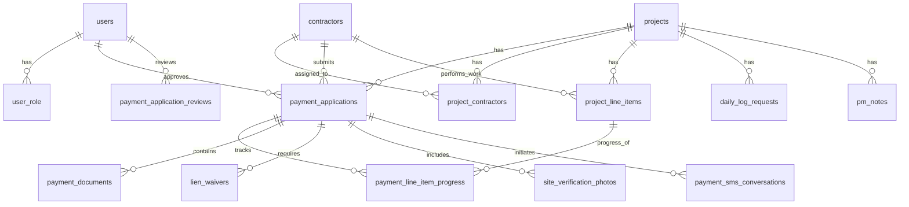

# ConstructionOps Database Schema

## Table of Contents
1. [Overview](#overview)
2. [Entity Relationship Diagram](#entity-relationship-diagram)
3. [Core Tables](#core-tables)
4. [Table Details](#table-details)
5. [Relationships](#relationships)
6. [Indexes](#indexes)
7. [Row Level Security (RLS)](#row-level-security-rls)
8. [Common Queries](#common-queries)

---

## Overview

The ConstructionOps database is built on **PostgreSQL 15** via Supabase, leveraging:
- **Row Level Security (RLS)** for data isolation
- **Foreign key constraints** for referential integrity
- **Triggers** for automated timestamp updates
- **Sequences** for auto-incrementing IDs

**Database Structure:**
- **Core Tables** include `users`, `projects`, `contractors`, `payment_applications`, etc.
- **Relationships** link projects to contractors, line items, and payments.
- **Indexes** optimize performance for key lookups.
- **RLS Policies** enforce role-based access control (Admin, PM, Staff).

---

## Entity Relationship Diagram

---

## Core Tables

| Table | Purpose | Key Columns |
|-------|---------|-------------|
| `users` | User accounts and profile data | id, email, role, uuid |
| `user_role` | Role assignments | user_id, role |
| `projects` | Construction projects | id, name, client_name, budget |
| `contractors` | Subcontractors/vendors | id, name, trade, phone, email |
| `project_contractors` | Project-Contractor links | project_id, contractor_id, contract_amount |
| `payment_applications` | Payment requests | id, status, current_payment |
| `payment_sms_conversations` | SMS workflow state | id, payment_app_id, conversation_state |

---

## Table Details

### users
*Stores user account information and profile data.*
- `id` (INTEGER, PK): Auto-incrementing primary key
- `email` (VARCHAR, UNIQUE): User email address
- `role` (VARCHAR): User role (admin, pm, staff)
- `uuid` (UUID): Reference to Supabase Auth user
- `name` (VARCHAR): User's full name
- `phone` (VARCHAR): Contact number
- `company` (VARCHAR): Company name
- `address` (TEXT): Physical address
- `avatar_url` (TEXT): Profile image URL
- `created_at` (TIMESTAMP): Record creation time

### user_role
*Stores role assignments for permission management.*
- `id` (BIGINT, PK): Primary key
- `user_id` (UUID): Foreign key to `auth.users.id`
- `role` (TEXT): Role name (admin, pm, staff)
- `created_at` (TIMESTAMPTZ): Record creation time
- `updated_at` (TIMESTAMPTZ): Last update time

### projects
*Stores construction project details.*
- `id` (INTEGER, PK): Primary key
- `name` (VARCHAR): Project name
- `client_name` (VARCHAR): Client/Owner name
- `project_code` (VARCHAR, UNIQUE): Unique identifier
- `status` (VARCHAR): Project status (active, completed, etc.)
- `budget` (NUMERIC): Total project budget
- `spent` (REAL): Amount spent to date
- `start_date` (DATE): Project start date
- `target_completion_date` (DATE): Expected completion
- `current_phase` (VARCHAR): Current construction phase
- `at_risk` (BOOLEAN): Risk flag
- `created_at` (TIMESTAMP): Record creation time
- `updated_at` (TIMESTAMP): Last update time

### contractors
*Stores subcontractor information.*
- `id` (INTEGER, PK): Primary key
- `name` (VARCHAR): Company name
- `trade` (VARCHAR): Trade specialty
- `phone` (VARCHAR): Contact phone (for SMS)
- `email` (VARCHAR): Contact email
- `status` (VARCHAR): Active/Inactive status
- `contract_amount` (NUMERIC): Total value of contracts
- `paid_to_date` (NUMERIC): Total paid across all projects
- `last_payment` (VARCHAR): Date of last payment
- `performance_score` (NUMERIC): Rating (0-100)
- `created_at` (TIMESTAMP): Record creation time
- `updated_at` (TIMESTAMP): Last update time

### project_contractors
*Links contractors to projects (Contracts).*
- `id` (INTEGER, PK): Primary key
- `project_id` (INTEGER, FK): Reference to projects
- `contractor_id` (INTEGER, FK): Reference to contractors
- `contract_amount` (NUMERIC): Contract value for this project
- `paid_to_date` (NUMERIC): Paid amount for this project
- `contract_status` (VARCHAR): Active/Completed/Terminated
- `change_orders_pending` (BOOLEAN): Pending CO flag
- `last_payment_date` (DATE): Date of last payment

### payment_applications
*Tracks payment requests and approvals.*
- `id` (INTEGER, PK): Primary key
- `project_id` (INTEGER, FK): Reference to projects
- `contractor_id` (INTEGER, FK): Reference to contractors
- `status` (VARCHAR): initiated, sms_sent, submitted, approved, rejected
- `current_payment` (NUMERIC): Amount requested
- `total_contract_amount` (NUMERIC): Total contract value
- `previous_payments` (NUMERIC): Previously paid
- `payment_period_end` (DATE): Period end date
- `sms_conversation_id` (INTEGER): Linked SMS conversation
- `approved_by` (INTEGER, FK): Approver user ID
- `approved_at` (TIMESTAMP): Approval time
- `rejected_by` (TEXT): Rejector name/ID
- `rejected_at` (TIMESTAMPTZ): Rejection time
- `rejection_notes` (TEXT): Reason for rejection
- `created_at` (TIMESTAMP): Record creation time

### payment_sms_conversations
*Manages SMS workflow state for payments.*
- `id` (INTEGER, PK): Primary key
- `payment_app_id` (INTEGER, FK): Linked payment app
- `contractor_phone` (VARCHAR): Phone number used
- `conversation_state` (VARCHAR): State (awaiting_start, in_progress, etc.)
- `current_question_index` (INTEGER): Progress tracking
- `responses` (JSONB): Stored contractor responses
- `completed_at` (TIMESTAMP): Completion time
- `created_at` (TIMESTAMP): Record creation time

---

## Relationships

- **Projects ↔ Contractors**: Many-to-Many (via `project_contractors`)
- **Projects ↔ Payment Apps**: One-to-Many
- **Contractors ↔ Payment Apps**: One-to-Many
- **Payment Apps ↔ SMS Conversations**: One-to-One (typically)

---

## Row Level Security (RLS)

RLS is enabled on all core tables to ensure data security.

**General Policy Structure:**
- **SELECT**: All authenticated users can view most core data (projects, contractors).
- **INSERT/UPDATE**: Restricted to Admins and Project Managers (PMs).
- **DELETE**: Restricted to Admins only.
- **Helper Functions**: Policies use `is_admin_or_pm()` for consistent role checks.

**User Role Policy:**
- Users can view their own role.
- Only Admins can manage (create/update/delete) roles.

---

## Indexes

Performance indexes are created on frequently queried columns:
- Foreign keys (`project_id`, `contractor_id`, `user_id`)
- Status columns (`status`, `conversation_state`)
- User emails and UUIDs for authentication lookups.
